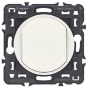

*To contribute to this page, edit the following
[file](https://github.com/Koenkk/zigbee2mqtt.io/blob/master/docs/devices/ZLGP17_ZLGP18.md)*

# Legrand ZLGP17/ZLGP18

| Model | ZLGP17/ZLGP18  |
| Vendor  | Legrand  |
| Description | Wireless and batteryless (double) lighting control |
| Exposes | action, linkquality |
| Picture |  |

## Notes

### Green Power
This is a Zigbee Green Power device which allows it to be very energy efficient.
Messages from Green Power devices cannot be "understood" by normal Zigbee devices, therefore they need to be "translated" first.
Not all Zigbee devices can do this translation, currently the only devices known to do this are Philips Hue devices. This means that the Green Power device has to be in range of a Philips Hue device in order to use it.

Green Power devices don't support binding and are not included in network scans.

### Pairing ZLGP17
To pair this device on channel 11, hold the configuration button (on the back of the device) and press the main button (up or down).

This device can work on any channel, not only 11. For this, please refer to the [Legrand ZLGP17 manual chapter 6.2](https://www.admin.legrandoc.com/files/documents/S000111963EN-00.pdf).

### Pairing ZLGP18
To pair this device on channel 11, hold the configuration button (on the back of the device) and press the button (up or down) on the first side, then do the same for the second side.

Note: each side of the device is treated as a single ZLGP17.

This device can work on any channel, not only 11. For this, please refer to the [Legrand ZLGP18 manual chapter 6.2](https://www.admin.legrandoc.com/files/documents/S000112516EN-00.pdf).

## Exposes

### Action (enum)
Triggered action (e.g. a button click).
Value can be found in the published state on the `action` property.
It's not possible to read (`/get`) or write (`/set`) this value.
The possible values are: `press_once`, `press_twice`.

### Linkquality (numeric)
Link quality (signal strength).
Value can be found in the published state on the `linkquality` property.
It's not possible to read (`/get`) or write (`/set`) this value.
The minimal value is `0` and the maximum value is `255`.
The unit of this value is `lqi`.

